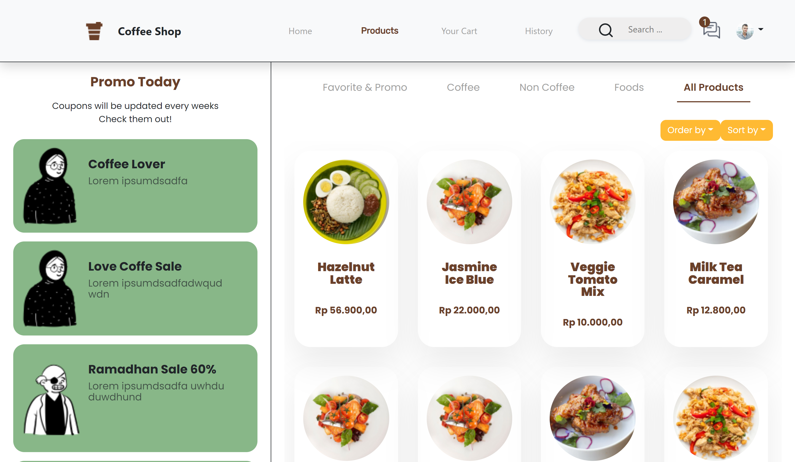
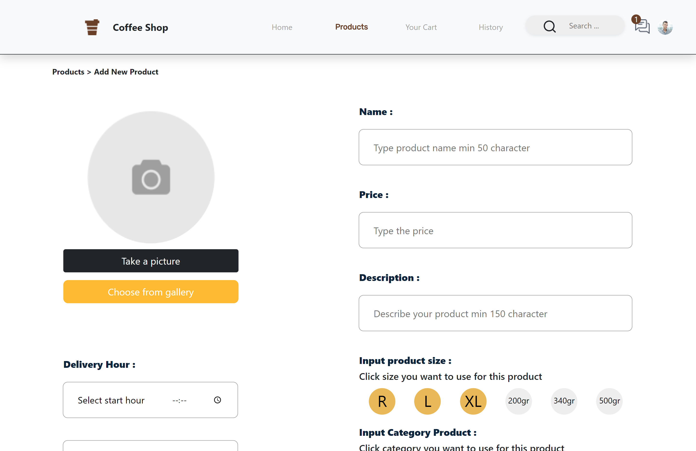

<div align="center">
  
  <h1>COFFEE SHOP</h1>

 [](https://www.npmjs.com/package/axios) [](https://www.npmjs.com/package/redux) [](https://www.npmjs.com/package/bootstrap) [](https://www.npmjs.com/package/bootstrap)[](https://www.npmjs.com/package/react-router-dom)

<br/>

</div>


Coffee shop website is a service for order coffe, food and beverages. Customer can simply register, login, see products, order, see order history, edit their profile, etc.

## DEMO

[Demo in Netlify](https://coffeeshop-heroku.netlify.app/)

## Features

### Users:

- Register
- Login
- Search Products
- Filter Products
- Products Detail
- Edit Profile
- Payment or Checkout

### Admin:

- Create Product

## How to Run the Application

### 1. Clone the Repository

Clone this repository by running the following command :

```shell

$ git clone https://github.com/ghofarasnanto/React-Commerce

```

### 2. Install dependency packages

Install dependency packages by run the following code inside project folder:

```shell

$ npm install

```

OR

```shell

$ npm i

```

### 3. Set up Project

- Configure url file

Configure url file by create file named BASE_URL inside project folder and add this line to the file:

<br/>

```shell
BASE_URL = "process.env.REACT_APP_BASE_URL"
```

- Configure .env file

Configure .env file by create file named .env inside project folder and add this line to the file:

<br/>

```shell
REACT_APP_BASE_URL = "YOUR HOST"
```

- Run Project

Run the app in development mode after server/backend is running. with a command like the following :

```
$ npm run start
```

Open http://localhost:3000 in your browser after project running.

The page will reload when you make changes.\
You may also see any lint errors in the console.


## Screenshots

<div style="display:flex" align="center">
<div>


</div>
<div>


</div>
</div>

<br/>

# Related Projects

[Coffee Shop - Backend](https://github.com/ghofarasnanto/coffeshop-node)